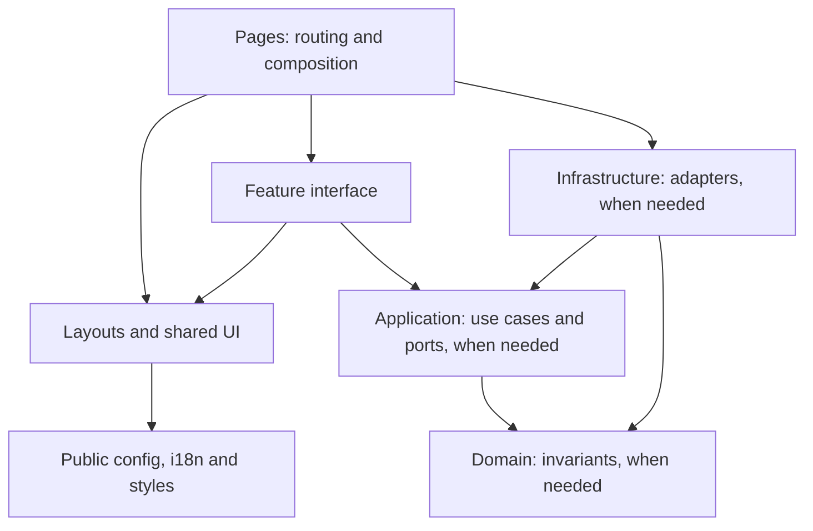

# Website architecture

The application delivers a public bilingual website as static HTML, with explicit
feature ownership and enforceable dependency direction. The initial product is
one basic home page in two languages. Design, editorial content, services, a CMS
and a database are separate future requirements.

## Current structure

```text
src/
  pages/                     URL mapping and composition roots
    [locale]/index.astro      Statically generated /es/ and /en/
    404.astro                Bilingual recovery, noindex
    robots.txt.ts            Static crawler endpoint
  layouts/                   HTML document, global assets, metadata wiring
  components/                Shared SEO, language and theme controls
  modules/
    home/                    Initial feature presentation
  config/site.ts             Approved public identity and canonical origin
  i18n/                      Locale types, route pairs, typed message catalogs
  styles/                    Semantic theme tokens and shared styling
scripts/
  architecture/              AST-based dependency guard and regression fixtures
  ai/                        Skill, contact identity and semantic-color checks
```

Aliases use `@/` for `src/`; relative imports are also valid and checked. Tests live
beside pure TypeScript behavior; production browser tests live in `e2e`.



Home currently contains a presentation file directly in its feature folder.
Explicit layer directories are optional until a feature has separate responsibilities.
The other feature layers have a defined
contract and automated checks now, and receive files when a real responsibility
exists. No empty persistence repositories or unused dependency-injection container
are needed to maintain those boundaries.

## Dependency contract

| Owner                                          | Allowed dependencies inside `src`                                                       |
| ---------------------------------------------- | --------------------------------------------------------------------------------------- |
| Pages                                          | Compose shared UI, feature interfaces/use cases/adapters and server facilities          |
| Shared layouts                                 | Layouts, components, public config, i18n and styles                                     |
| Shared components                              | Components, public config, i18n and styles                                              |
| Public config, i18n, styles                    | Their own area only                                                                     |
| Feature domain                                 | Same feature's domain only; no external packages                                        |
| Feature application                            | Same feature's application and domain; no external packages                             |
| Feature infrastructure                         | Same feature's infrastructure/application/domain, shared server and public config       |
| Feature presentation (root files or interface) | Same feature's interface/application/domain; shared components, config, i18n and styles |
| Shared server, when introduced                 | Shared server and public config; no features or presentation                            |

Cross-feature imports are rejected. A real collaboration between features should
be wired through ports at a composition root, or introduce an explicitly reviewed
public contract and corresponding rule tests. Infrastructure implements ports;
application code never constructs an infrastructure adapter. UI receives public
view data rather than persistence objects or credentials.

`architecture:check` uses TypeScript and Astro parsers, including static imports,
side-effect imports, reexports, type imports and literal dynamic imports. It
normalizes alias/relative/root-relative paths and follows browser-script imports transitively.
Browser graphs cannot reach feature domain/application/infrastructure, shared
server files, Node builtins or `astro:env/server`. Non-literal imports are rejected
because this gate cannot resolve them reliably. New resolver aliases or import
mechanisms need matching guard coverage before adoption.

This checks declared source imports, not all generated/bundled code or data flow.
It is not a security boundary by itself: review external packages, runtime APIs,
serialized props and emitted assets. Typechecking resolves actual module existence;
secret isolation and endpoint authorization still need explicit implementation.

## Rendering and localization

- `output: static` produces `dist/`, with no application server requirement.
- `/es/` and `/en/` are independent, cacheable documents. Cookies and browser
  language do not change their content. `/` redirects to `/es/`.
- Central route pairs drive internal links, canonical paths and reciprocal
  `hreflang`; each page's default-locale URL is its `x-default`.
- Catalog types catch missing values, and a parity test catches extra/missing keys
  in either language. Add formatted plurals only when actual content needs them.
- Static sitemap and robots use the public production origin; missing URLs return
  a non-indexable 404. The deployment must serve `404.html` with status 404 and
  preserve trailing-slash URLs; verify that on the chosen host.
- Astro markup requires no hydration framework. A short browser script enhances
  the theme button; an inline initializer restores the override before paint.
  CSS follows the OS with no JavaScript. Fonts are served from local build assets.

Explicit language URLs improve discoverability, sharing and cache semantics.
Prefixes alone are not faster. Static output avoids the old per-request locale
resolution; actual speed still depends on assets, host, network and content.

## Adding capabilities

### A content or services page

Add a named feature interface, both message catalogs, a route pair and thin route
composition. For editorial content, use a schema-validated Astro content collection
when entries need structured fields. Choose local files versus a CMS based on the
publishing workflow; neither is installed for hypothetical content. Add equivalent
locale links and metadata tests, including an appropriate x-default for that page.

### A form or database-backed page

1. Decide whether data can be fetched at build time or needs per-request execution.
   Public build-time data can remain static. Sensitive writes require a server.
2. Record a deployment adapter/runtime decision. Astro supports selected on-demand
   routes alongside prerendered pages; a static file host alone cannot run them.
3. Add the feature's domain rules, application use case and narrow port, then an
   infrastructure adapter. Validate external inputs in its interface boundary.
4. Wire it from a server route/action entry point. Preserve the existing public
   pages' static rendering where suitable. Review the import gate when adopting a
   new framework entry point so it remains a recognized composition root.
5. Add server-only environment validation, failure handling, abuse controls and
   appropriate authorization for the actual operation. Secrets never enter
   `site.ts`, public environment variables, markup or client bundles.
6. Test meaningful use-case failures and adapter behavior; add the browser journey.
   A database also requires migrations, backups, connection management and hosting
   operations. Those are real costs, not capabilities provided by an empty folder.

### Rich interactions

Use a focused script for modest behavior. Add a framework island when complex
state justifies it, with deliberate hydration timing and an accessible HTML
fallback. A dashboard with pervasive shared client state may justify a separate
application or a different framework. Astro does not remove those tradeoffs.

## Engineering tooling decisions

| Practice                | Current choice and reason                                                                                                |
| ----------------------- | ------------------------------------------------------------------------------------------------------------------------ |
| Dependency direction    | Executable feature and browser import rules, tested with invalid fixtures                                                |
| Type safety             | Astro strictest preset, separate tooling TypeScript check                                                                |
| Lint/format             | ESLint Astro/TypeScript recommended rules and Prettier Astro parser                                                      |
| Behavioral verification | Vitest pure logic, Node tool fixtures, Playwright production journeys                                                    |
| Accessibility           | axe in light/dark, keyboard checks and manual rendered review                                                            |
| Unused code             | Knip with Astro entry discovery; no speculative dependencies                                                             |
| Duplication             | jscpd, zero clones at an 80-token/10-line window across source/scripts, excluding tests; Astro files tokenized as TSX    |
| Supply chain            | Pinned Node/pnpm, frozen lockfile, SHA-pinned CI actions, read-only permissions, Dependabot and high/critical audit gate |
| Agent instructions      | Canonical `.agents/skills`, discovery symlink, applicability/reference validation and separate change/design review      |
| Identity                | One public config, approved contact guard and browser assertions; manual review for other unapproved names/links         |
| Not installed           | ORM, auth, database, CMS, renderer framework, monorepo tooling, container stack; select for concrete capabilities        |

The custom `astro-development` skill covers this application and links current
official docs. Generic contributor skills targeting framework internals or older
versions do not substitute for verified application instructions.

## Verification and operations

```sh
pnpm install --frozen-lockfile
pnpm run check
pnpm run test:coverage
pnpm exec playwright install chromium
pnpm run test:e2e
pnpm run security:audit
```

`check` includes formatting, skill/identity guard, import boundaries, tool tests,
lint, typecheck, unit tests, build, dead-code and clone checks. Browser and registry
checks are separate because they need a browser/server and external service.
CI runs all three categories; local execution is not evidence of remote CI success.
Chromium desktop/mobile coverage is not cross-engine browser certification.

No deployment or production runtime is configured by this foundation. Before
publication, verify host routing/404 behavior, TLS, canonical domain and cache
headers; apply a host-specific CSP compatible with the intentional theme script.
See [ADR 0005](adr/0005-astro-foundation.md) for alternatives and migration tradeoffs.

The E2E preview wrapper uses the documented experimental Astro programmatic API
to keep lifecycle ownership with Playwright; the CLI can auto-background under an
agent. Astro is pinned to a minor series and the real browser suite checks startup
and teardown. Recheck this API when upgrading Astro.

Knip explicitly marks the Playwright preview wrapper as an entry because its
command-string discovery does not trace that file. It is executed by the E2E suite.

## Keeping the foundation clean

A dependency or procedure must have a current caller, check, or explicit task
trigger. Existing files are not a reason to retain a tool or impose a pattern.

The current runtime uses Astro, sitemap generation and two self-hosted font
families. Tailwind compiles the existing styling. TypeScript, lint/format tools,
Vitest, Playwright/axe, Knip, jscpd and the import parser each serve an executable
check. Node's test runner covers the repository scripts without another runner.
No React renderer, database, ORM, CMS, container or monorepo framework is installed.

Skills apply only to their stated task: implementation, design, review, Git or
future server work. They are not a mandatory sequence for every change. A server
skill documents an extension path; it does not require creating a backend.
Superseded framework decisions are preserved in Git/source backups rather than
kept beside current operating instructions.

The root redirect is declared in `astro.config.ts`. The entry follows [ADR 0006](adr/0006-language-entry.md): prefixed language
URLs, a fixed default entry and visible equivalent-page links. Astro emits an
HTML refresh redirect for a static build. Configure `/` → `/es/` as HTTP 301 at
the eventual host and verify it there; local static preview is not proof of an
HTTP redirect in production. Exclude the redirect source from the sitemap.
